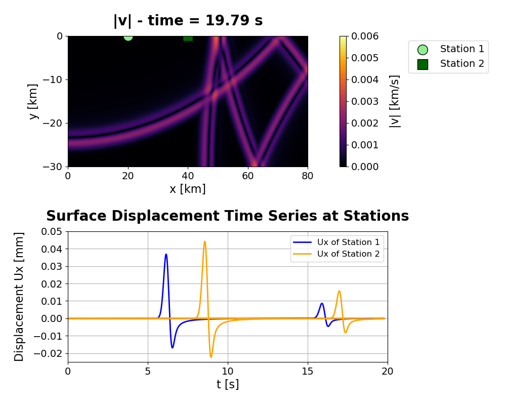

# Simulation of Seismic Wave Propagation in 2D Elastic Media

## 📖 Table of Contents
- [📝 Introduction and Background](#-introduction-and-background)
  - [Programming Tools](#programming-tools)
  - [Finite Element Method](#finite-element-method)
  - [Boundary Conditions](#boundary-conditions)
  - [Initialization of Wave Propagation](#initialization-of-wave-propagation)
  - [Time Integration](#time-integration)
  - [Synthetic Seismograms](#synthetic-seismograms)
- [🔶 Limitations](#-limitations)
- [🔨 Getting Started](#-getting-started)
  - [General Requirements](#general-requirements)
  - [Setting up the Project and Running the Code](#setting-up-the-project-and-running-the-code)
- [🔍 Results](#-results)
- [📚 References](#-references)

## 📝 Introduction and Background 

This code simulates two-dimensional seismic wave propagation in an elastic homogeneous medium by employing numerical modeling to analyze wave behavior in a geophysical setting. 
Furthermore, it computes displacement time series at the surface and constructs synthetic seismograms for stations located at varying distances from the source. 
Additionally, it identifies the peaks of P- and S-wave arrivals and calculates their velocities based on the seismograms, comparing them with theoretical values.

### Progamming Tools 

The programming language *Julia* and the *Visual Studio Code editor* were utilized for this purpose. For the visualization, the Julia package *Plots* and *Pyplot*
were used to create graphical plots of the simulation results, while the *Measure* package allowed the customization of the plot layouts.

### Core Equations

The theoretical velocities of P- and S-waves are calculated using the following equation. Here, *K* is the bulk modulus, *G* the shear modulus and *ρ* the density of the medium.

$$
v_p = \sqrt{\frac{K + \frac{4}{3}G}{\rho}}
$$

$$
v_s = \sqrt{\frac{G}{\rho}}
$$

In a two dimensional continuum, addressing changes in the x and y directions, the force balance is given as:

$$
\begin{aligned}
\rho \frac{\partial v_x}{\partial t} &= \frac{\partial \tau_{xx}}{\partial x} + \frac{\partial \tau_{xy}}{\partial y} - \frac{\partial P}{\partial x}, \\
\rho \frac{\partial v_y}{\partial t} &= \frac{\partial \tau_{yy}}{\partial y} + \frac{\partial \tau_{xy}}{\partial x} - \frac{\partial P}{\partial y}
\end{aligned}
$$

This equation describes the state of a medium under the influence of external forces and stresses

### Finite Element Method 

The *finite element method* (FEM) was uitilized for the modeling of seismic wave propagation, which allowed the division of the system into discrete
parts, allowing continuous physical equations to be solved numerically.  

### Boundary Conditions

In this project, the *Neuman Boundary Conditions* were applied to define the behavior at the edges of the local domain. These conditions ensure 
zero particle velocity across the edges and as a result confine the wavefield within the domain. The Neumann boundary conditions were applied as follows:

$$
\frac{\partial v_x}{\partial y} = 0
$$

$$
\frac{\partial v_y}{\partial x} = 0
$$

### Initialization of Wave Propagation

The *Gaussian function* was employed to represent a localized disturbance in terms of pressure (P) and stress (τ). This function simulates a disturbance with an energy 
source that is both localized and smoothly distributed.

$$
f(x, y) = a \cdot \exp\left(-\frac{(x - x_0)^2 + (y - y_0)^2}{2\sigma^2}\right)
$$

### Time Integration

The 'Courant-Friedrichs-Lewy (CFL)' condition is used, which is a stability criterion for numerical simulations of partial differential equations. By keeping the 
appropriate ratio of the time step to the spatial resolution, it prevents the numerical solution from becoming unstable as it exceeds the relation of order 
of system’s maximum wave speed.

$$
\Delta t \leq \frac{\Delta x}{v_p \cdot C}
$$

### Synthetic Seismograms

The finite-difference method was employed to update the wave equation velocities and stresses at each time step. At each iteration, values were calculated for every grid cell as time progressed. The average horizontal velocity was then extracted from the grid cell closest to the station. Instantaneous displacements were computed by multiplying the velocity by the time step.

$$
u_x = v_x \cdot \Delta t
$$

## 🔶 Limitations 

While this simulation successfully demonstrates the propagation of elastic seismic waves in a simplified, homogeneous domain, it has many limitations:

- Numerical artifacts such as distorted wave velocities and arrival times are introduced by numerical dispersion, coarse grid resolution,
  and reflective boundaries.
- Simplistic assumptions of a homogeneous elastic medium oversimplify the real-world geology and therefore doesn't account for heterogeneities, anisotropy, and layering.
- Restriction to two dimensions limits application to real-world seismic events, which occur in three dimensions.

 Despite these limitations, the simulation offers a valuable framework for understanding seismic wave behavior under idealized conditions. 

 ## 🔨 Getting Started 
 ### General Requirements
 To run the code, ensure following tools are installed:

- **Julia**: Version 1.11 or higher ([Click here to Download Julia](https://julialang.org/downloads/))
- **Code Editor**: Visual Studio Code (recommended) ([Download VSCode](https://code.visualstudio.com/))
- **Git**: Required for cloning the repository ([Click here to Download Git](https://git-scm.com/))
- **Code Editor**: For example Visual Studio Code ([Download VSCode](https://code.visualstudio.com/))

Run the the following lines in Julia REPL to install the necessary packages:

### Setting up the Project and Running the Code

To start setting up the project, create a new directory where you want to store the project. Then open your terimanl and execute the following command:

Then initialize the project by cloning the repository:

The last step is to execute the code by running the following in the Julia REPL: 

The simulation uses default parameters, which can be modified directly in the script:
- Domain size: 80 x 30 km (xmin, xmax = 0, 80e3 | ymin, ymax = -30e3, 8)
- Grid resolution: ncx, ncy = 400, 250
- Bulk modulus: K = 5e10 Pa
- Shear modulus: G = 3e10 Pa
- Density: ρ = 2700 kg/m³
- Distance of surface stations from source: Station 1 = 20 km, Station 2 = 40 km (xst1, yst1 = 20e3, 0.0 | xst2, yst2 = 40e3, 0.0)

## 🔍 Results

The simulation generates:
- Visualiazation of Wave Propagation: A heatmap illustrates the velocity magnitdue over time across the domain. 
  --> Images are saved every 100th time step in a PNG format.
- Synthetic Seismograms: Records the displacement time series at the surface stations.
- Theoretical velocities of the P- and S-waves.
- Measured velocities of the P- and S-waves: Determines the measured velocities from the seismogram.
- Arrival Times of the P- and S-waves: Extracts the arrival times from the seismogram. 

The following outputs can be gained using the default parameters:

  

This image illustrates the wave propagation and synthetic seismogram, inlcuding the surface displacement at time step Δ = 2400.

|           | P-wave Velocity (km/s) | S-wave Velocity (km/s) | P-wave Arrival Time (s) | S-wave Arrival Time (s) |
|-----------|-------------------------|-------------------------|--------------------------|--------------------------|
| Theoretical | 5.774                 | 3.337                 | -                        | -                        |
| Station 1 | 6.114                 | 3.365                 | 6.133                   | 10.673                  |
| Station 2 | 6.032                 | 3.381                 | 6.365                   | 10.892                  |

### Occuring Discrepancies
The simulation revealed discrepancies between the theoretical and measured velocities, particularly for the S-waves. These discrepancies primarily arise due to the limiting factors mentioned above. Additionally, the oscillation observed in the seismogram is a result of using instantaneous displacement.

## 📚 References

- Modulhandbuch Geowissenschaften, 2021. Zugriff am 17. Januar 2025.
- C. Chapman. Seismic Wave Propagation in Elastic Media. Cambridge University Press,
 Cambridge, 1 edition, 2004. Online publication date: January 2010.
- J. Achenbach. Wave propagation in elastic solids. Elsevier, 2012.
- P. Bormann, B. Engdahl, and R. Kind. Seismic wave propagation and earth models. In New
 manual of seismological observatory practice 2, pages 1–105. Deutsches GeoForschungsZen
trum GFZ, 2012.
- J. Bezanson, A. Edelman, S. Karpinski, and V. Shah. The julia programming language, 2012. Version 1.11, accessed January 10, 2025.
- Microsoft Corporation. Visual studio code, 2015. Version 1.96, accessed January 10, 2025.
- J. Semblat and J. Brioist. Efficiency of higher order finite elements for the analysis of seismic
 wave propagation. Journal of Sound and Vibration, 231(2), 2000.
- F. Broggini, M. Vasmel, and D. Robertsson, J.and van Manen. Immersive boundary condi
tions: Theory, implementation, and examples. Geophysics, 82(3):T97–T110, 2017.
- J. Dickinson, S. James, S. Mehl, M. Hill, S. Leake, G. Zyvoloski, C. Faunt, and A. Ed
debbarh. A new ghost-node method for linking different models and initial investigations
 of heterogeneity and nonmatching grids. Advances in Water Resources, 30(8):1722–1736, 2007.
- A. Baratta and I. Corbi. Epicentral distribution of seismic sources over the territory. Ad
vances in Engineering Software, 35(10-11):663–667, 2004.
- S. Evje and T. Fl˚atten. Cfl-violating numerical schemes for a two-fluid model. Journal of
 Scientific Computing, 29:83–114, 2006.
- Ankit Rohatgi. Webplotdigitizer, 2023. Accessed: January 17, 2025.

✤ *This was the final project for the BWp1 Geophysical Methods: Introduction to Geophysical Project Work (WiSe 24/25), supervised by Prof. Dr. T. Duretz, Goethe University Frankfurt.*

